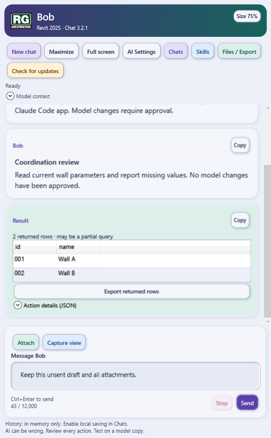
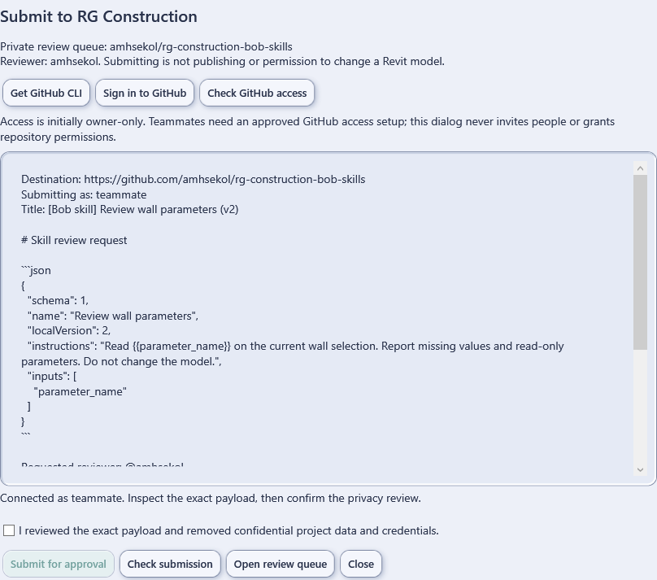
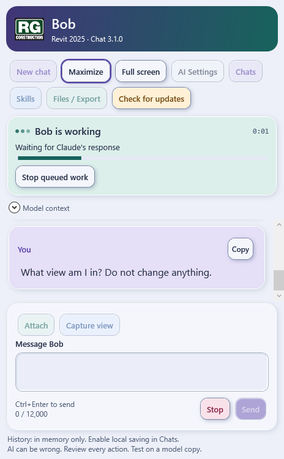

# AI RG: Bob for Revit

Public installer distribution for Bob 3.2.1, supporting Revit 2024, 2025 and 2026 on Windows. Anyone may download and install it without a GitHub account. This repository contains installation scripts, compiled installer packages, checksums, documentation and installer tests, not the private add-in development repository or its history.

## Install with one command

Save your work and **close every Revit window**. Open PowerShell as your usual Windows user and paste this line, then press Enter:

```powershell
irm 'https://raw.githubusercontent.com/amhsekol/ai-rg-bob-installer/main/Setup-Bob.ps1' | iex
```

No GitHub account, GitHub CLI or GitHub sign-in is required. This all-in-one command finds Claude Code or installs the official `Anthropic.ClaudeCode` package through winget, reuses a confirmed eligible Claude sign-in or starts official browser sign-in, installs Bob and configures its executable path. It verifies the downloaded Bob installer and package, makes installation backups and removes temporary downloads. No manual ZIP handling or path copying is needed.

Each person still completes their own browser sign-in and approves company/project-data sharing in Bob's AI Settings. New installs do not automatically enable cloud sharing, advanced generated-code execution or local chat saving. Existing settings are preserved; a changed settings file is backed up before its path is updated.

This command executes the setup script published in this repository. Review `Setup-Bob.ps1` and `Install-Bob.ps1` if you prefer to inspect them first. If winget is missing or execution is blocked, ask IT; do not bypass organizational restrictions. An eligible Claude subscription or organization-assigned access is required.

The installer targets all three supported years by default. It does not install Revit itself, close Revit forcibly, install a Windows service or silently run future updates.

After installation, open a model copy and choose **AI RG → Chat with Bob**. Confirm the header says **Chat 3.2.1**. Existing users keep their Claude settings and sign-in.

For add-in-only installation, without installing/signing into Claude or configuring its path, the previous command remains available:

```powershell
irm 'https://raw.githubusercontent.com/amhsekol/ai-rg-bob-installer/main/Install-Bob.ps1' | iex
```

## New in 3.2.1: workspace size and installer fix

Choose **Size 100%** in Bob's header to scale text, buttons, tables, message cards
and spacing together. Preview 75–150% with the slider or use **Compact 75%**,
**Comfortable 85%**, **Default 100%** or **Large 125%**.
Choose **Save size** to remember it for your Windows user, or **Cancel** to restore
the previous size. Other dialogs remain at their normal scale so recovery
controls stay readable.

While Bob has focus, **Ctrl+plus/minus** or **Ctrl+mouse wheel** adjusts and saves
the size in 5% steps; **Ctrl+0** resets to 100%. The same workspace retains its
scale when maximized, full screen and returned to dock. This changes neither
Windows scaling nor the Revit model view. Display-only saving preserves current
on-disk consent, execution permissions and other preferences.

The installer now ignores content directories ending in `.Addin`, including the
Autodesk BIM 360 Issues folder that could trigger the earlier `Get-Content`
access-denied failure. Actual manifest files are still checked for conflicts.
Genuinely unreadable files or folders stop installation safely; the installer
does not elevate permissions, delete Autodesk files or alter their ACLs.

Native Windows fixture screenshots, not a live Revit session:



[Default 100% comparison](screenshots/Bob-3.2.1-Default-100.png)

## Retained from 3.2.0: submit a skill for review

In **Skills**, select a recipe and choose **Submit for approval**. The dialog shows
the exact selected skill, verifies the private RG Construction review repository,
asks for explicit consent and sends a review issue without rewriting the chat
composer. It includes visible progress, cancellation, status checks and persistent
receipts to prevent duplicate sends after ambiguous network failures.

**Public installation is separate from private skills access.** The RG skills
repository currently has owner-only access. The optional submission feature needs
the user's own official GitHub CLI sign-in and authorized private repository access.
Installing Bob grants neither. Everyone can still use Bob's other features with
their own supported Revit installation and eligible Claude connection.

This release does **not** implement reviewer-controlled publishing, automatic
approved-library sync or teammate access onboarding. Submissions, closed issues
and local Reviewed flags never approve publication or model changes.
Chats, attachments, project labels and model snapshots are not automatically sent
with a skill; users must remove any sensitive information from its instructions.



## Colorful neumorphic workspace

Bob 3.1.0 adds softly raised rounded buttons, inset input fields, layered conversation cards and a shared visual theme across chat, settings, chats, skills, files, updates and code review. Lavender marks conversation tools, blue marks skills/view capture, mint marks files/data, and amber marks updates/review. Every action retains its text label; color is not the sole indicator.

The release retains all previously shipped features and safety gates. Body messages use 16-pixel text, keyboard focus has a visible ring, and Windows high-contrast colors are used for the core palette at startup with decorative shadows disabled. Activity animations continue to respect Windows motion preferences.

The toolbar wraps compactly in a narrow dock. **Model context** expands to show the last-send model/view/selection snapshot, leaving more space for the conversation.

Native Windows test-harness screenshots are included with the release. They use simulated model/provider data and are not evidence of a live Revit session.



[Full-screen workspace screenshot](screenshots/Bob-3.1-Full-Screen.png)

## Future updates inside Bob

Starting with 3.0.1, choose **Check for updates** inside Bob. Automatic checks are enabled by default and check daily while Bob/Revit is running; a newer published version produces an in-panel notice. You can disable automatic checks in the Updates window. There is no background service or notification while Revit is closed.

Choose **Install after Revit closes**, review the release, then approve **Download and schedule**. Bob downloads and verifies the package and opens an updater window. Save your models, close ALL Revit windows yourself, and leave the updater open. It waits up to two hours, verifies the package again, installs with backups and tells you when to reopen Revit. No commands or GitHub login are needed; Windows PowerShell runs internally and company execution policies still apply. Do not close the updater or reopen Revit during installation.

The update retains chats, skills and Claude settings. Cancel during download to stop before scheduling; close the updater before installation starts to cancel a queued update. Check again to retry after an offline check, cancelled updater or timeout. Logs/results live under `%LOCALAPPDATA%\RGConstruction\RevitAI\workspace\updates`. Tests do not replace live shutdown/restart acceptance on a workstation.

Users on 3.0.0 or earlier need to run the public install command once to get these controls. Later published releases can be installed from Bob.

## First-time Claude setup

Installing Bob does not include a Claude account or subscription. Each user needs their own eligible Claude account or organization-assigned access and must authorize sending project data.

If official Claude Code is not installed, run:

```powershell
winget install --id Anthropic.ClaudeCode --exact
```

Open a new PowerShell window, then:

```powershell
claude auth login
(Get-Command claude).Source
```

Use your own account in the official sign-in flow. In Bob's **AI Settings**, set the full executable path returned by the second command, review cloud-data permission and check the subscription connection. Never share credentials, tokens or device authorization codes.

## Included workflows and limits

- **Workspace:** Visible Maximize opens a maximized window in one click. Full screen removes window chrome; F11 toggles it and Esc exits full screen without cancelling work. Return to dock preserves the same chat, draft and request. Read-only result tables, tooltips and direct Continue for clarification choices remain available.
- **Visible activity:** Prominent working card, moving activity bar, staggered pulse dots, actual stage labels, elapsed time and queued-work Stop. Approval waiting, completion and errors are distinct states. No invented percentages or pretend activity while idle.
- **Chats:** New/previous conversations, search, rename, pin, archive and safe resume. Disk history is opt-in in Chats.
- **Skills:** Built-in and personal instruction recipes, editable inputs, versions, reviewed imports and optional private review submissions. Project/Team collections are local, not cloud-synchronized; publishing controls are not included.
- **References:** Text, selected PDF text pages, selected XLSX worksheets and PNG/JPG previews; view capture. No scanned-PDF OCR.
- **Exports:** Chat PDF/Markdown/XLSX, bounded host-view inventories, parameter templates and drawing PDFs.
- **Imports:** Same-open-session writable text instance parameters and separately approved RFA loading. Numeric/type parameters and dedicated RVT/IFC/DWG imports are not supported.

This is an **unsigned build**, not production certification. Real Revit behavior and the user's Claude connection need testing on model copies. Model changes require approval. Advanced generated code, if explicitly enabled, is full-trust and not sandboxed.

Activity animation respects Windows reduced-motion settings. Native Revit operations that occupy its UI thread can temporarily pause the display; an animation is not a guarantee that Revit is responsive. Elapsed time includes provider and approval waiting, not an estimate of time remaining.

## Privacy and distribution

Anyone can download this installer. Compiled .NET assemblies can be inspected or decompiled; distributing binaries is not a guarantee that implementation details remain secret.

The installer does not include employee accounts, model files, saved chats or Claude credentials. Bob sends approved messages, references and requested model information through the user's own Claude Code connection. Review company/project policy before enabling cloud-data permission.

Local opted-in history and skills live under `%LOCALAPPDATA%\RGConstruction\RevitAI\workspace`. History is not encrypted by Bob. Provider retention is independent of local history.

## Verification and rollback

The package includes `START-HERE.md`, `UI-VERIFICATION.md`, per-year build manifests and dependency notices. Keep the backup path printed during installation; follow the included rollback instructions if required.

The current ZIP SHA-256 is:

```text
1a9284d3c65c548d7c1f8b7e9edb5450b27273f0a5de55d35f8a310944326ffd
```

The public installer workflow tests Windows PowerShell 5.1 and PowerShell 7, checks the package hash and rejects unsafe archive paths before publishing a release. Automated checks do not replace live testing inside Revit.
